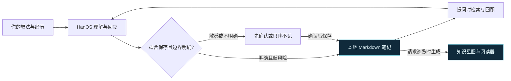

# HanOS


<sub>知识星图概念插画，由 AI 生成；不含真实笔记，并非产品界面截图。</sub>

**把值得留下的对话，变成能找回、能连接、能继续生长的个人知识库。**

**许可：源码公开，仅限非商业使用。** 采用 [PolyForm Noncommercial 1.0.0](LICENSE)；商业用途须另行取得权利人的书面授权。

HanOS 是一个运行在 AI Agent 中的知识管理 Skill。你可以用自然语言记录想法、回顾经历、整理项目，也可以让它从已有笔记里找回线索。内容保存在你自己的 Markdown 文件中，需要浏览时，再生成一张可以搜索、缩放和阅读的知识星图。

你不必先设计一套复杂的笔记系统。从一个想留下的念头开始就可以。

> “记下这个方法，下次做类似的事时提醒我。”
>
> “我之前为什么做了那个决定？”
>
> “把最近关于这个主题的记录整理一下。”
>
> “打开我的知识星图。”

[快速开始](#快速开始) · [日常使用](#日常使用) · [知识星图](#知识星图) · [隐私与控制](#隐私与控制) · [支持情况](#支持情况)

当前候选版本：**0.1.0-preview.1**。需要帮助时查看[排障与卸载](docs/troubleshooting.md)；参与开发和了解后续范围可查看[维护路线](docs/roadmap.md)。

## 能帮你做什么

| 场景 | HanOS 的工作方式 |
| --- | --- |
| 留下想法与方法 | 从对话中提取少量、值得长期保留的内容，优先更新已有笔记，并说明保存了什么。 |
| 找回过去的思考 | 根据问题读取相关索引和笔记，把答案连接回来源，区分事实、推测与历史记录。 |
| 整理项目与主题 | 在已有知识范围内整理记录、建立链接，保留决定的来由和后续变化。 |
| 回顾经历与感受 | 先回应具体经历，再给出谨慎的理解和可行动的建议；涉及敏感内容时先确认是否保存。 |
| 看见知识之间的联系 | 根据笔记链接和标签生成本地 HTML 星图，在同一页面搜索、浏览和阅读。 |
| 在不同 Agent 中使用 | 多个客户端共用一份 Skill 核心和你选定的知识目录，减少重复维护。 |

HanOS 通过你正在使用的 Agent 读写文件。它不会在后台监听，也不会逐字收集所有对话。普通的一次性问题不需要触发知识操作。



笔记保留内容，星图提供入口；每次回顾，都能回到有来源的记录。

## 快速开始

### 1. 准备环境

- 一台电脑，安装 **Python 3.9 或更新版本**。
- 至少一个[支持的 Agent 客户端](#支持情况)，具备本地文件访问能力。
- 一个用于存放私人知识的目录，**放在 HanOS 源码目录之外**。
- 查看星图时使用现代桌面浏览器。当前版本面向电脑，手机使用暂不在支持范围内。

安装器和 HTML 生成器只使用 Python 标准库，无需额外安装 Python 依赖。实际对话使用你的 Agent 客户端和模型服务，费用与数据处理方式由相应服务决定。

### 2. 安装到你的客户端

下载本仓库源码压缩包并解压，或克隆你要使用的发布版本。在包含 `install.py` 的目录打开终端，选择**一条**对应命令：

```bash
# OpenAI Codex
python3 install.py --agent codex

# Claude Code
python3 install.py --agent claude-code

# Cursor
python3 install.py --agent cursor

# GitHub Copilot / VS Code
python3 install.py --agent copilot

# Gemini CLI
python3 install.py --agent gemini-cli
```

如果确实需要安装全部客户端适配器，可以使用 `python3 install.py --agent all`。

安装器会询问知识库名称和存放位置，创建或复用初始知识目录，安装相应入口，并运行自检。每个人都使用自己的配置和知识目录；分享 HanOS 时，分享源码即可。

安装后开启新的客户端会话，或按客户端的方式重新加载 Skill。需要再次检查安装时，运行：

```bash
python3 install.py --doctor
```

看到 `HANOS_DOCTOR=PASS` 表示安装结构检查通过。若客户端没有发现 Skill，请按其文档检查发现或加载设置；安装自检不代替客户端中的实际运行验证。

### 3. 开始第一段对话

在客户端中调用 HanOS，然后说：

> 开始我的知识库。

首次引导会逐个了解你想用的名字、如何称呼你、当前关注的事情和希望得到的回应。你可以跳过问题，也可以直接说“先用起来”。有具体内容时，HanOS 会先处理内容，不要求先答完问卷。

调用方式取决于客户端，例如 `$hanos`、`/hanos`，或直接使用你配置的名称。

## 日常使用

**记下一件事。** 告诉它你学到的方法、正在推进的计划，或想留给未来自己的一个提醒。HanOS 会根据内容判断是否适合保存；明确、低风险且值得长期保留的部分可以自动整理。

**找回一条线索。** 问“我之前怎么想的”，或指出具体项目、主题。它应先查相关记录，再解释来源，不把旧笔记当作当前外部事实。

**整理一组记录。** 明确说出要整理的主题和范围。修改已有结论时会保留可辨认的历史；删除、移动或归档内容前需要确认。

**写下一段经历。** 你可以直接讲今天发生了什么。HanOS 会先回应内容，再区分原始经历、可能的理解和行动建议。它不会把推测写成事实，也不做心理诊断。

**决定哪些内容留下。** 某段内容只想聊聊，可以说“这段不要记录”；理解有偏差，可以直接纠正。涉及高度敏感内容、归属不清或保存位置不明确时，HanOS 应先询问。

## 知识星图

对 HanOS 说“打开我的知识星图”，即可请求生成当前知识库的 HTML 视图。

深蓝背景、浅青色星点和缓慢流动的连线，让笔记的关系变得可见。星图横向展开，采用 2:1 布局，桌面默认面板占视口高度的 60%；拖拽探索、细腻的滚轮缩放和展开视图让大图谱也能逐步阅读。

- 识别 `[[WikiLink]]`、相对 Markdown 链接和行内 `#标签`。
- 悬停查看直接关联，点击笔记进入同页阅读器。
- 搜索仓库名称、笔记标题、路径和预览内容。
- 保留尚未解析的链接，方便回到源笔记修补关系。
- 支持暂停连线动画，并尊重系统的减少动态效果设置。

HTML 内嵌样式和交互代码，不依赖外部字体、CDN 或网络请求。所有适配器安装同一版生成器；每个人的笔记内容、图谱形状和系统字体可能不同，页面设计保持一致。

Markdown 是内容来源，HTML 是生成时的快照。修改笔记或升级生成器后，需要重新生成视图。

> **生成的 HTML 包含笔记正文和路径，应与知识库一样保密。** 展示项目时使用虚构示例，不要上传真实知识星图。

需要直接运行生成器或自定义输出位置，见 [HTML 视图说明](skills/hanos/references/html-view.md)。

想先试一份完全虚构的知识库，可以在源码目录运行：

```bash
python3 scripts/demo.py --output /absolute/path/to/new-hanos-demo
```

该命令只写入你指定的新目录，生成 3 个演示知识区、12 篇虚构笔记及 `knowledge-overview.html`。用桌面浏览器打开 HTML 即可体验真实界面，原有知识库不参与演示。截图请使用这个示例。

## 隐私与控制

你的知识内容保存在你选择的本地目录。公开源码只包含 Skill、安装器、模板、测试和虚构示例。

- 只提取值得保留的部分，不把整段对话作为默认存储单位。
- 写入前检查目录和知识归属，优先更新已有内容。
- 敏感信息、破坏性操作和不明确的写入先确认；凭据、密钥和无关的第三方私密信息不应保存。
- 不会因为安装 Skill 而启动后台服务、数据库或文件监听器。
- 你可以直接查看和编辑 Markdown 文件，不需要专有数据库或专用阅读器。

**本地存储不等于模型处理完全离线。** Agent 读取的笔记可能被发送到你配置的模型服务。使用敏感材料前，请了解客户端和模型提供方的数据政策。Skill 中的行为规则也不能代替客户端权限控制。

发布或分享时，只使用经过检查的公开源码包。`.gitignore` 能帮助排除私人文件，但无法清除已经进入提交历史的信息。详见 [隐私说明](docs/privacy.md)和[安全报告方式](SECURITY.md)。

## 支持情况

| 客户端 | 安装与包结构检查 | 原生运行证据 |
| --- | --- | --- |
| OpenAI Codex | 通过 | 2026-09-17 完成读取、记录、找回、纠正、不记录、生成 HTML 六步验收 |
| Claude Code | 通过 | 未完成验证 |
| Cursor | 通过 | 未完成验证 |
| GitHub Copilot / VS Code | 通过 | 未完成验证 |
| Gemini CLI | 通过 | 未完成验证 |

当前是源码公开预览阶段。独立公开副本的自动化检查覆盖安装、发布边界、HTML 和星图布局；这些结果不代表全部客户端、操作系统和模型组合已经验证。当前 Codex 原生证据日期为 2026-09-17；公开副本在 macOS 上通过 89 项测试。远端 CI 尚未运行，完整证据见下方评测文档。

详见 [客户端说明](docs/supported-agents.md)、[可移植性报告](docs/portability-report.md)和[评测记录](tests/behavioral-evals/results.md)。

## 升级

下载新版本后，在新源码目录运行安装器，使用原有的客户端、知识目录和显示名称。安装器会保留已安装的客户端集合，并检查托管文件是否被修改。

随后运行 `python3 install.py --doctor`，重新加载客户端，并请求重新生成 HTML，才能在旧知识库上看到新版星图。

具体命令、非交互安装和恢复说明见 [安装与升级指南](docs/getting-started.md)。

暂时停用、完整移除入口但保留笔记，以及常见报错的处理，见[排障与卸载](docs/troubleshooting.md)。

## 参与开发

```text
skills/hanos/                  共享 Skill 核心与行为说明
skills/hanos/scripts/          HTML 生成器与星图布局
adapters/                      各客户端的薄适配层
Templates/                     通用配置和知识模板
examples/demo-knowledge-base/  虚构示例
tests/                        安装、发布、图谱及行为评测
install.py                     安装器与 doctor
```

从 Git checkout 的仓库根目录运行公开测试：

```bash
python3 -m unittest discover -s tests
```

发布检查需要 Git 和有效的 `HEAD`；部分 HTML 交互检查需要 Node.js，缺少时会标为跳过。仅安装和生成 HTML 不需要 Node.js。

欢迎贡献文档、可复现的问题报告和真实客户端的验证结果。请使用虚构数据复现问题，并保留不同客户端共用一个行为核心的设计。提交前阅读 [贡献指南](CONTRIBUTING.md)。

公共文件由 `release-files.txt` 精确列举。新增文件须同步白名单；发布步骤、CI 验证和版本包校验见[发布指南](docs/releasing.md)。Issue 和 PR 使用仓库内的模板，安全问题按 [SECURITY.md](SECURITY.md) 处理。

## 许可证

采用 [PolyForm Noncommercial License 1.0.0](LICENSE)。本项目属于源码可见（source-available）项目；因限制商业用途，不属于 OSI 定义的开源软件。

- 允许许可证范围内的个人非商业学习、研究、试验、修改和分享；分发时须保留许可及要求保留的声明。
- 本许可证不授予商业用途所需的授权。将 HanOS 用于商业产品、商业服务或其他以商业应用为目的的活动前，须另行取得权利人的书面授权。
- 教育、公益、公共研究等组织的适用范围，以许可证的 `Noncommercial Organizations` 条款为准。
- 该许可适用于本版本中由项目权利人按此条款提供的内容。历史上已按其他许可合法获得的版本，仍按其原有许可行使权利；此次更改不追溯撤回已有授权。

以上是说明，完整权利与义务以 [LICENSE](LICENSE) 原文为准。
